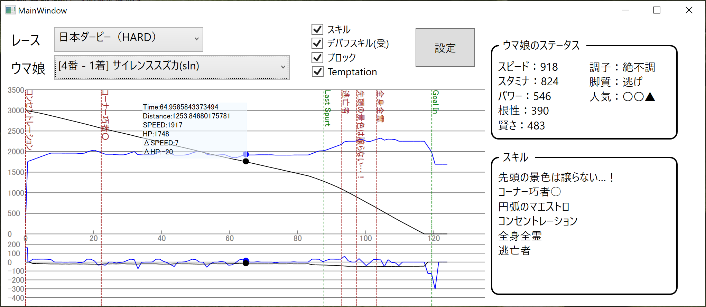

# UmaRaceHelper
ウマ娘用レース結果可視化ツール

このツールは windows 用です。

割と適当な作りになってますw

## 必要なもの
* ウマ娘の windows アプリに [CarrotJuicer](https://github.com/CNA-Bld/EXNOA-CarrotJuicer) が導入されていることが前提です。
* [MessagePack](https://github.com/neuecc/MessagePack-CSharp) のライブラリを使用しているので、別途ビルドしてください。
* .Net Framework 5 以上が必要です。[このあたり](https://dotnet.microsoft.com/en-us/download/dotnet/5.0) から .NET Runtime をダウンロードしてください。

## How to
UmaRaceHelper.exe を実行すると、ウマ娘のインストール先を指定するダイアログが出るので、指定してOKを押してください。
メインウィンドウが表示されたらウマ娘を起動してゲーム開始するだけです。

## Note
* このツールはサーバとアプリの通信内容を可視化するだけのツールなので、改造（いわゆるチート）はしてません。
* CarrotJuicer/ 以下にできるファイルをドラッグドロップで読み込む機能も持っているので、そのファイルにレース情報があれば、グラフを表示できるようになっています。

## snapshot

